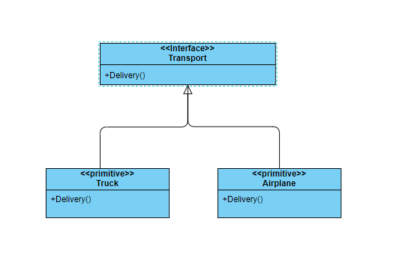

## 工厂模式

工厂模式是一种创建者模式，其在父类提供了一个创建对象的方法，由具体的子类来决定实例化对象的类型

### 问题

在本地有一个快递公司，使用卡车进行货物的运输; 随着公司的壮大，现在需要支持航空运输和轮船运输; 但是，之前的代码都是关于 `Truck`类的，在 `Truck`类中
有一个方法`Delivery()`,之前客户端就是创建一个`Truck`类，然后调用`Delivery()`方法就完成了运输;

公司的业务扩张，现在需要支持航空运输和轮船运输; 那要如何将这两种运输的方式添加进来呢？

以前的客户端直接创建`Truck`类，然后调用其`Delivery`方法就完成货物的运输了; 如果现在也分别添加`Air`类和`Ship`类的话，那么客户端代码就会变得复杂了。
首先，需要知道使用那种运输方式，然后再创建相应的对象; 这样的话，客户端代码和这些实体类就紧紧的耦合在一起了，这些类对象的任何改动，或者是有新的运输方式的加入都需要更改客户端的代码，并且客户端的代码会变得越来越难以维护

### 简单方案

为了将客户端代码和具体的对象创建代码隔离开来，此处就需要一个接口类型`Transport`，在接口类型中声明一个`Delivery`方法; 然后让不同的运输类实现这个方法即可，这样对于客户端而言只需要传入
具体的运输方式，就可以创建指定的类对象了



代码示例：

```
import "fmt"

type TransportSimple interface {
	Delivery() string
}

func CreateTransport(typ string) TransportSimple {
	switch typ {
	case "truck":
		return &Truck{}
	case "airPlane":
		return &AirPlane{}
	default:
		return nil
	}
}

type Truck struct{}

func (t *Truck) Delivery() string {
	return fmt.Sprintf("use truck delivery...")
}

type AirPlane struct{}

func (a *AirPlane) Delivery() string {
	return fmt.Sprintf("use airplane delivery...")
}

//客户端代码
func main() {
	t := CreateTransport("truck")
	t.Delivery()
}

```

上面的方案已经能够很好的解决运输方式的不断更新了;但是现在公司业务越来越复杂了，比如: 在`Delivery`之前需要先对货品进行分类，然后放到不同的仓库当中，等到运输工具空闲时，再去取货运输;
如果是这样的话，这种简单的方案就不能够应对了，因为这不仅涉及到了运输，还有其他的类;比如：store,category 等等;这时如果还用这种方式的话，客户端的代码就又会变得很复杂和庞大了，所以就需要更加复杂的一个解决方案了

### 复杂方案

为了能够解决公司业务的不断膨胀，这时就需要一个工厂接口了;在这个`Factory`接口中，不单只声明`CreateTransport()`方法，而且会有其他的操作了;此时的一个工厂就是一条生产线，包括：分类，存储，运输等操作了

然后，通过具体的`Creator`来实现具体的一条生产线; 客户端只需要创建一个`Factory`的实例就可以对货物进行分类，存储，运输等功能了;下面是类图示例：


代码示例如下：

```
package main

type Factory interface {
	CreateTransport() TransportSimple
	CreateStore() Store
}

type CreatorA struct{}

func (c *CreatorA) CreateTransport() TransportSimple {
	return &Truck{}
}

func (c *CreatorA) CreateStore() Store {
	return &ColdStore{}
}

type CreatorB struct{}

func (c *CreatorB) CreateTransport() TransportSimple {
	return &AirPlane{}
}

func (c *CreatorB) CreateStore() Store {
	return &HotStore{}
}

func CreateFactory(typ string) Factory {
	switch typ {
	case "coldWithTruck":
		return &CreatorA{}
	case "hotWithAirPlane":
		return &CreatorB{}
	}
	return nil
}

```

这样就能够应对公司业务的不断变化了; 可在 [Github 中查可完成代码示例](https://github.com/bad2cat/programming-essence/tree/main/designPattern/%E5%B7%A5%E5%8E%82%E6%A8%A1%E5%BC%8F)

### 优缺点

#### 优点

 你可以避免创建者和具体产品之间的紧密耦合。
 单一职责原则。 你可以将产品创建代码放在程序的单一位置， 从而使得代码更容易维护。
 开闭原则。 无需更改现有客户端代码， 你就可以在程序中引入新的产品类型。

#### 缺点

应用工厂方法模式需要引入许多新的子类， 代码可能会因此变得更复杂。 最好的情况是将该模式引入创建者类的现有层次结构中。